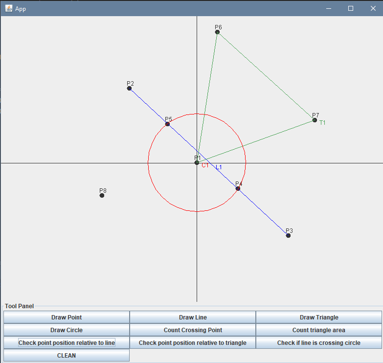

# Simple Calculator of Geometrical Figures

To create this project we use Java.

## Description

This is simple java project with GUI. GUI is implemented by the use of Swing library.

## Visuals

## Installation

Put this files in a separate folder. 

And if you use IntelliJ you should create a new project in this folder.